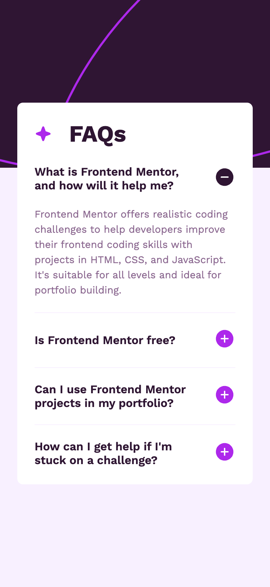
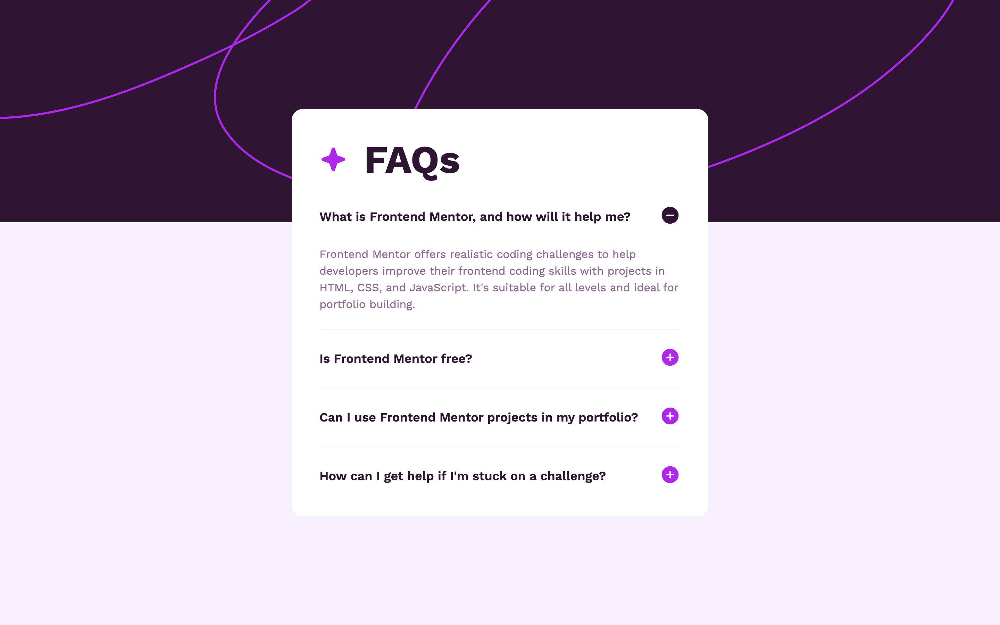

# Frontend Mentor - FAQ accordion solution

This is a solution to the [FAQ accordion challenge on Frontend Mentor](https://www.frontendmentor.io/challenges/faq-accordion-wyfFdeBwBz). Frontend Mentor challenges help you improve your coding skills by building realistic projects.

## Table of contents

- [Overview](#overview)
  - [The challenge](#the-challenge)
  - [Screenshots](#screenshots)
  - [Links](#links)
- [My process](#my-process)
  - [Built with](#built-with)
  - [What I learned](#what-i-learned)
  - [Continued development](#continued-development)
  - [Useful resources](#useful-resources)
- [Author](#author)

## Overview

### The challenge

Users should be able to:

- Hide/Show the answer to a question when the question is clicked
- Navigate the questions and hide/show answers using keyboard navigation alone
- View the optimal layout for the interface depending on their device's screen size
- See hover and focus states for all interactive elements on the page

|        Mobile designed at 375px:         |        Desktop designed at 1440px:        |
| :--------------------------------------: | :---------------------------------------: |
|  |  |

### Links

- Solution URL: [https://github.com/elisilk/faq-accordion](https://github.com/elisilk/faq-accordion)
- Live Site URL: [https://elisilk.github.io/faq-accordion/](https://elisilk.github.io/faq-accordion/)

## My process

### Built with

- Semantic HTML5 markup
- CSS custom properties
- Flexbox
- CSS Grid
- Mobile-first workflow
- Fluid typography and spacing
- Accessible

### What I learned

- [`
`](https://developer.mozilla.org/en-US/docs/Web/HTML/Element/details) and [`
`](https://developer.mozilla.org/en-US/docs/Web/HTML/Element/summary) - Wow! What an amazing solution. When looking around for CSS only, accessible accordion solutions it seems easy to go down a rabbit hole and start looking at ideas related to the use of [`:target`](https://developer.mozilla.org/en-US/docs/Web/CSS/:target) or ... But [Exclusive accordions using the HTML details element](https://developer.mozilla.org/en-US/blog/html-details-exclusive-accordions/) is the semantically-appropriate, even if less well known, solution for this. And using `
` makes the implementation so much easier. See also:
  - [Exclusive Accordion](https://developer.chrome.com/docs/css-ui/exclusive-accordion)
  - [How to build a CSS-only accordion](https://verpex.com/blog/website-tips/how-to-build-a-css-only-accordion)
- [Can I change the height of an image in CSS :before/:after pseudo-elements?](https://stackoverflow.com/questions/8977957/can-i-change-the-height-of-an-image-in-css-before-after-pseudo-elements) - I had to spend a little time trying to make sure the icons before the FAQ heading and in each FAQ summary were sized appropriately (and resized as well).
- [CSS Selectors](https://developer.mozilla.org/en-US/docs/Web/CSS/CSS_selectors) - Continuing to learn about and get comfortable with the different CSS selectors. I make use of the `:not` and `:first-child` selectors so that the first summary element doesn't have a top border. And I spent more time with [`:has` selector](https://tobiasahlin.com/blog/previous-sibling-css-has/) when I was trying to make a solution from `:target`, but didn't have a need for that in the current easier solution.
- [`background`](https://developer.mozilla.org/en-US/docs/Web/CSS/background) - Also still trying learn and get comfortable with the `background` shorthand. I find it hard to read the specifications and know what order each of the properties go in and what's required and things like that. Hopefully, with more experience, I will get better at reading the specifications and deciphering them.

### Continued development

Specific areas that the solution should be improved (known issues):

- I definitely think there is work to do on deciding when to transition from the background pattern for the mobile view versus the desktop view. Right now, the mobile view pattern probably is staying too long, so I should think about lowering the media query (it's currently at 750px).
- Had some errors in the HTML validator report that I need to address. The error was "Attribute "name" not allowed on element "details" at this point. `
`". The error shows up for all 4 of the `details` elements in my HTML document. But I don't fully understand what is wrong with adding the "name" attribute to that element given that [it is clearly a part of the specification](https://developer.mozilla.org/en-US/docs/Web/HTML/Element/details#name). Although maybe the [caniuse for this element](https://caniuse.com/details) is not at a sufficient level of adoption? Seems good to me. So not sure what to do, and I will have to look into it a bit more. I could potentially get rid of the "name" attribute and instead [insert a bit of JavaScript code like is done in this example](https://verpex.com/blog/website-tips/how-to-build-a-css-only-accordion). But then it wouldn't be CSS only, right?
- Consider overriding the `:marker` pseudo element that comes along with the `summary` element for inserting in the new icon, rather than building in a new `::after` element. Why not take advantage of the built-in elements as much as possible, right?

More general ideas I want to consider:

- Hmm 🤔 ...

### Useful resources

- [MDN Web Docs for CSS](https://developer.mozilla.org/en-US/docs/Web/CSS) - Went here a lot to reference the different CSS properties and the shorthands, and all the great explanations about best practices.
- [MDN Guides](https://developer.mozilla.org/en-US/docs/Learn)
- [The Clamp Calculator](https://royalfig.github.io/fluid-typography-calculator/) - Used for all of fluid typography and fluid spacing calculations.

## Author

- Website - [Eli Silk](https://github.com/elisilk)
- Frontend Mentor - [@elisilk](https://www.frontendmentor.io/profile/elisilk)
